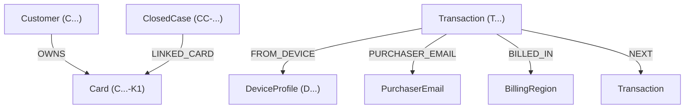

# Enterprise Fraud Investigation Platform
### Hacker House Goa 20-Case Benchmark & TigerGraph Intelligence System

An enterprise-grade fraud detection and investigation intelligence platform powered by **TigerGraph Savanna REST++**, GraphRAG policy retrieval, automated R1–R10 policy execution, and stateful multi-step AI investigation agents.

---

## 🌟 Overview & Key Capabilities

- **Stateful AI Investigation Engine:** Automatically processes high-risk transaction alerts, conducts multi-hop graph queries, evaluates evidence, issues next-best-action (NBA) recommendations, and files Suspicious Activity Reports (SAR).
- **TigerGraph Savanna REST++ Graph Core:** Connects transaction events to Customer, Card, DeviceProfile, BillingRegion, and PurchaserEmail vertices across live graph relationships (`OWNS`, `FROM_DEVICE`, `PURCHASER_EMAIL`, `BILLED_IN`, `NEXT`).
- **GraphRAG & Policy Engine:** Implements R1–R10 risk scoring, evidence thresholds, mandatory customer validation triggers, and regulatory filing requirements.
- **Enterprise React UI Dashboard:** Features a 20-case directory, live search & multi-attribute filter matrix, interactive Graph Connected Entities grid, traceable evidence panel, audit timeline, and SAR decision manager.
- **Official 20-Case Submission Package:** Includes fully validated JSON submission outputs conforming strictly to official benchmark contracts (`cases/HHG-001.json` – `cases/HHG-020.json`).

---

## 📐 Architecture Overview

```
                          ┌───────────────────────────┐
                          │    Vite + React UI        │
                          │   (Dashboard & Matrix)    │
                          └─────────────┬─────────────┘
                                        │ HTTP / REST
                                        ▼
                          ┌───────────────────────────┐
                          │   FastAPI Backend Server  │
                          │     (app.api:app)         │
                          └─────────────┬─────────────┘
                                        │
             ┌──────────────────────────┼──────────────────────────┐
             ▼                          ▼                          ▼
┌─────────────────────────┐ ┌───────────────────────┐ ┌────────────────────────┐
│  Investigation Agent    │ │   GraphRAG Policy     │ │   TigerGraph Savanna   │
│ (Multi-step Reasoning)  │ │   Retriever (R1-R10)  │ │   REST++ Graph Core    │
└─────────────────────────┘ └───────────────────────┘ └────────────────────────┘
```

### Component Breakdown
1. **Frontend (`frontend/`)**: Vite-powered React 18 SPA rendering live case statuses, risk probabilities, graph entity attributes, policy rules, and SAR forms.
2. **Backend (`backend/app/api.py`)**: FastAPI REST API handling case details (`GET /cases/{id}`), transaction details (`GET /transactions/{id}`), live customer search (`GET /search`), and benchmark endpoints.
3. **Agent & Policy Engine (`backend/app/investigation/`)**: Executes investigation workflows, evaluates policy rules, maintains audit progression, and serializes evidence requests and next-best actions.
4. **TigerGraph Adapter (`backend/app/integrations/tigergraph/`)**: Connects securely to TigerGraph Savanna via REST++ API using token/secret authentication.

---

## 🕸️ TigerGraph Schema & Role

The TigerGraph database models enterprise banking relationships as a multi-graph:



- **Graph Role in Investigation:** 
  - Trace shared device profiles across multiple cards to detect organized card-testing rings.
  - Traverse billing region anomalies and non-cardholder email domain usage.
  - Retrieve prior closed case history (`CC-...`) linked to the customer or card to assess recurring patterns.

---

## 🔄 Investigation Case Flow

1. **Trigger Alert Ingestion:** Case initialized from `risk_score` anomaly, `customer_report`, or `analyst_request`.
2. **Graph Expansion:** Query TigerGraph for transaction vertex attributes, connected device profiles, billing region, purchaser email, and card owner.
3. **Historical Memory Retrieval:** Fetch prior closed cases for the card/customer to establish pattern baselines (`card_testing`, `card_not_present_fraud`, `out_of_region_use`, `card_not_present_new_device`, `account_takeover`).
4. **Initial Next Best Action (NBA):** Formulate initial recommendations (e.g., `VERIFY_WITH_CUSTOMER`, `BLOCK_CARD`, `DECLINE_TRANSACTION`) with approval routes (`auto`, `L1`, `L2`).
5. **Evidence Collection:** Record evidence claims with exact entity references and serialize any required `evidence_requests`.
6. **Final Next Best Action & SAR Decision:** Re-evaluate rules after evidence resolution; generate regulatory SAR narrative, subjects, dates, and amounts when `FILE_REPORT` is recommended.

---

## 🛠️ Setup & Prerequisites

### Prerequisites
- **Python**: Version 3.10+ (Python 3.11/3.12 recommended)
- **Node.js**: Version 18+ (Node 20+ recommended) and `npm`

### 📂 Local Dataset Placement
For full database ingestion and local TigerGraph graph seeding:
- Place the provided raw transaction dataset (`transactions.csv`) and identity dataset (`identity.csv`) in `data/raw/`.
- The repository tracks `data/raw/case_pack.csv` and `data/raw/closed_cases_history.csv` required for benchmark execution. Large raw datasets (`transactions.csv` ~700MB, `identity.csv` ~26MB) are excluded from version control via `.gitignore`.

---

## 🔑 Environment Configuration

1. Copy `.env.example` to `.env`:
   ```bash
   cp .env.example .env
   ```

2. Configure your TigerGraph Savanna credentials in `.env`:
   ```ini
   TG_HOST=https://your-tigergraph-instance.tgcloud.io
   TG_GRAPH_NAME=HHGOA_FRAUD
   TG_SECRET=your_tigergraph_secret
   TG_API_TOKEN=your_tigergraph_token
   ```

---

## 🚀 Execution Instructions

### 1. Run the Backend API Server
From the repository root:
```bash
python -m uvicorn app.api:app --reload --host 127.0.0.1 --port 8000
```
- Health Check: `http://localhost:8000/health`
- API Documentation: `http://localhost:8000/docs`

### 2. Run the React Frontend Dashboard
From the `frontend/` directory:
```bash
cd frontend
npm install
npm run dev
```
- Interface URL: `http://localhost:3000`

### 3. Build Frontend for Production
From the `frontend/` directory:
```bash
cd frontend
npm run build
```

---

## 📊 Benchmark Generation & Validation

### 1. Run 20-Case Benchmark Pipeline
Executes the full investigation agent against all 20 benchmark cases and generates both `outputs/benchmark_answers.json` and `cases/HHG-001.json` through `cases/HHG-020.json`:
```bash
python scripts/run_benchmark.py
```

### 2. Validate Benchmark Output
Runs rigorous automated verification against official submission contracts and schema invariants:
```bash
python scripts/validate_benchmark.py
```

### 3. Run Automated Pytest Test Suite
```bash
python -m pytest tests/
```

---

## 📁 Repository Structure

```text
hhgoa-fraud-investigation/
├── cases/                     # Official 20-case submission package (HHG-001.json - HHG-020.json)
├── backend/                   # FastAPI backend server application
│   └── app/
│       ├── api.py             # REST API endpoints (/cases, /transactions, /search)
│       ├── integrations/      # TigerGraph REST++ adapter and models
│       └── investigation/     # Agent, policy engine, models, state, and graph service
├── frontend/                  # React + Vite enterprise UI application
│   ├── src/
│   │   ├── components/        # Modular UI components (Workspace, Evidence, SAR, Timeline, GraphNodesGrid)
│   │   ├── state/             # React hooks (useCases)
│   │   └── api/               # API client
│   ├── package.json           # Frontend dependencies
│   └── vite.config.js         # Vite build configuration
├── data/                      # Benchmark data fixtures
│   └── raw/
│       ├── case_pack.csv      # Authoritative 20-case benchmark definitions
│       ├── closed_cases_history.csv # Historical closed case memory
│       └── README.md          # Dataset schema specification
├── agent/                     # Autonomous reasoning chains and agent tools
├── detection/                 # Fraud anomaly scoring models and pipelines
├── tigergraph/                # GSQL queries, schemas, and staging scripts
├── scripts/                   # Benchmark runners, case checkers, and validators
│   ├── run_benchmark.py       # 20-case benchmark runner
│   ├── validate_benchmark.py  # Comprehensive schema validator
│   └── check_cases.py         # TigerGraph case check script
├── tests/                     # Automated unit, integration, and policy test suite
├── .env.example               # Environment variables template (safe placeholders)
├── .gitignore                 # Version control exclusions
├── requirements.txt           # Backend Python dependencies
└── README.md                  # Project documentation
```

---

## 📦 20-Case Official Submission Package Format

The submission package contains 20 individual case files in `cases/` (`cases/HHG-001.json` ... `cases/HHG-020.json`). Each file conforms strictly to the official dataset schema:

```json
{
  "case_id": "HHG-001",
  "case": {
    "status": "closed_legitimate",
    "verdict": "legitimate",
    "fraud_probability": 0.05,
    "pattern": "none",
    "pattern_description": "",
    "affected_txn_ids": [],
    "first_suspicious_txn_id": "",
    "connected_card_ids": [],
    "connected_device_profiles": [],
    "exposure_usd": 0.0,
    "evidence": [...],
    "similar_prior_cases": [...],
    "summary": "...",
    "written_to_graph": false,
    "graph_case_id": ""
  },
  "evidence_requests": [...],
  "next_best_actions": {
    "initial": [...],
    "final": [...],
    "what_changed": "..."
  },
  "sar": {
    "file": false,
    "reason": "...",
    "narrative": "",
    "subjects": [],
    "total_amount_usd": 0.0,
    "activity_dates": []
  },
  "stop_reason": "...",
  "tool_calls": 1,
  "tokens": 1500,
  "latency_s": 0.5
}
```

> **Note on Large Datasets:** Source transaction dataset (`transactions.csv`, ~700MB) and identity dataset (`identity.csv`, ~26MB) are excluded from the repository via `.gitignore` in accordance with repository size limits. Benchmark execution relies on `data/raw/case_pack.csv`, `data/raw/closed_cases_history.csv`, and live TigerGraph REST++ queries.
